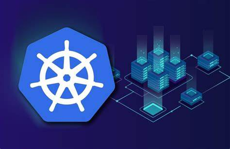
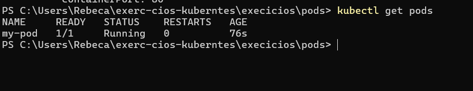
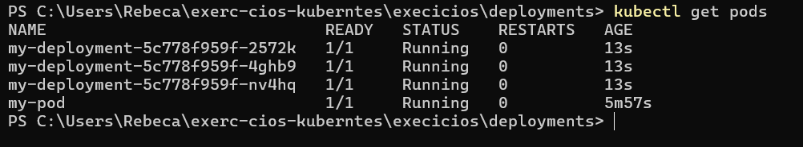
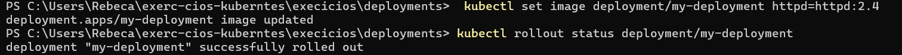
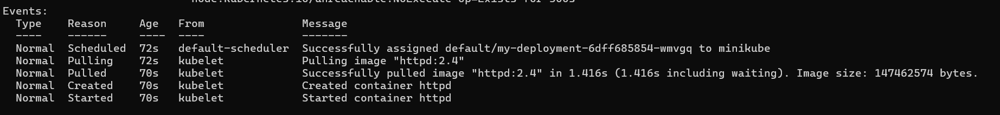

#  Projeto Kubernetes


Este projeto consiste em uma lista de exercícios práticos que têm como objetivo demonstrar o uso do Kubernetes em ambientes de desenvolvimento. Ao longo deste exercício, aprendi e pratiquei diversas operações essenciais para trabalhar com Kubernetes, incluindo:

- **🛠 Criação e gerenciamento de Pods**: Entendimento de como criar pods e acompanhar seu estado dentro de um cluster Kubernetes.
- **⚙️ Trabalhando com Deployments**: Compreensão sobre como implantar e gerenciar múltiplas réplicas de aplicações, garantindo alta disponibilidade e escalabilidade.
- **📜 Configuração de arquivos YAML**: Criação e modificação de arquivos de configuração YAML para definir recursos no Kubernetes, como Pods, Deployments, Services, entre outros.
- **📈 Escalabilidade de Pods**: Aplicação de técnicas de escalabilidade automática de pods, utilizando recursos como o Horizontal Pod Autoscaler (HPA) para ajustar a quantidade de réplicas conforme a demanda de CPU.
- **💾 Armazenamento Persistente**: Implementação de PersistentVolumes (PV) e PersistentVolumeClaims (PVC) para garantir que dados sejam preservados mesmo após a reinicialização dos pods.
- **🔐 Segurança e Configuração**: Criação e uso de ConfigMaps e Secrets para armazenar e gerenciar variáveis de configuração e informações sensíveis de maneira segura.

Este exercício permitiu aprofundar o entendimento sobre os conceitos-chave do Kubernetes e como aplicar esses conhecimentos na prática para gerenciar e orquestrar containers de forma eficiente.

##  Exercícios Realizados

1. **Criação de Pod**: Criação de um pod "my-pod" usando a imagem "nginx" e verificação de seu estado.
2. **Implantação de Deployment**: Implantação de um Deployment "my-deployment" com três réplicas utilizando a imagem "httpd", seguido da atualização para uma versão mais recente da imagem.
3. **ConfigMap**: Criação de um ConfigMap "app-config" e montagem em um pod para testar a configuração.
4. **Secret**: Criação de um Secret "app-secret" contendo informações sensíveis e injeção como variável de ambiente em um pod.
5. **PersistentVolume**: Configuração de um PersistentVolume de 1Gi e vinculação com um PersistentVolumeClaim. Verificação da persistência ao salvar arquivos.
6. **ClusterIP Service**: Criação de um serviço do tipo ClusterIP para o Deployment "backend" e teste de conectividade interna entre pods.
7. **Batch Job**: Implantação de um Job "batch-job" que executa um comando simples e termina. Verificação de logs para confirmação da execução.
8. **Horizontal Pod Autoscaler**: Criação de um HPA para o Deployment "hpa-deployment" e escalonamento com base no uso de CPU.
9. **NodePort Service**: Criação de um serviço do tipo NodePort para expor externamente um Deployment "webapp" e acesso via Minikube.
10. **Pod com política de reinício "OnFailure"**: Criação de um pod "restart-pod" e teste de sua política de reinício ao provocar falhas.

## Tecnologias Utilizadas

- **Kubernetes**: Orquestração de containers.
- **Minikube**: Ambiente de desenvolvimento local para Kubernetes.
- **Docker**: Containerização das aplicações.
- **kubectl**: Ferramenta de linha de comando para interagir com o Kubernetes.

Antes de iniciar a criação do pod e das demais atividades, instalei o **Minikube** e o **kubectl**. Para dar início à formação do cluster, executei o seguinte comando:

```bash
minikube start --driver=docker
```
Esse comando inicia a inicialização do Minikube, executando o cluster dentro do Docker.

Inicio das atividades

 1. Criar um Pod chamado "my-pod" usando a imagem "nginx"

 no Powershell apliquei o comando 

 ```bash
 code my-pod.yaml
 ```
Com esse comando eu abri o vscod e começei com a criação do my-pod

**[Clique aqui para acessar o arquivo my-pod.yaml](./execicios/pods/my-pod.yaml)**

Para criar o pod, executei o seguinte comando:

```bash
kubectl apply -f my-pod.yaml
```



O próximo passo foi criar um Deployment chamado my-deployment com três réplicas, utilizando a imagem httpd. A configuração foi feita no arquivo my-deployment.yaml, com o comando 

 ```bash
 code my-deployment.yaml
 ```

**[Clique aqui para acessar o arquivo my-pod.yaml](./execicios/deployments/my-deployment.yaml)**

```bash
kubectl apply -f my-deployment.yaml
```



para atualizar a imagem para uma versão mais recente (httpd:2.4)
 foi utilizado o comando 

```bash
 kubectl set image deployment/my-deployment httpd=httpd:2.4
```


para verificar a atualização 

```bash
kubectl describe pod my-deployment
```
Em Events esta a atualização da imagem:


